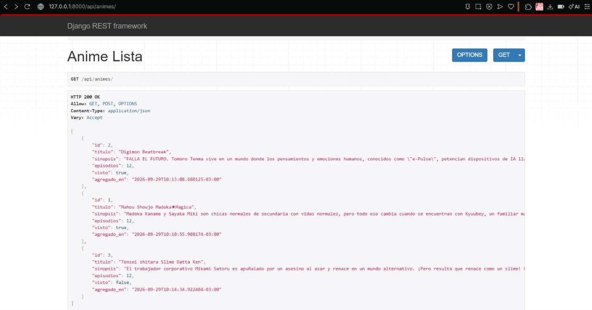
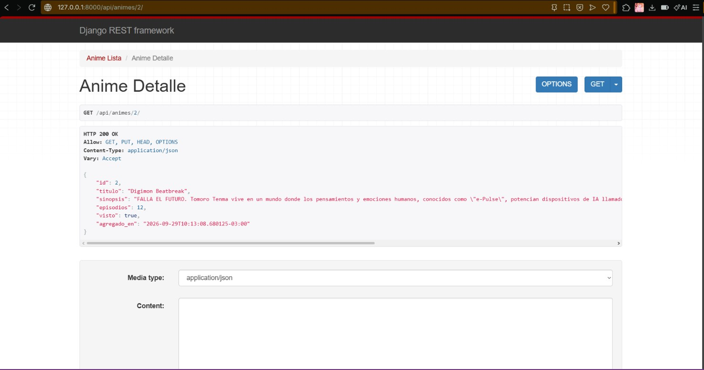
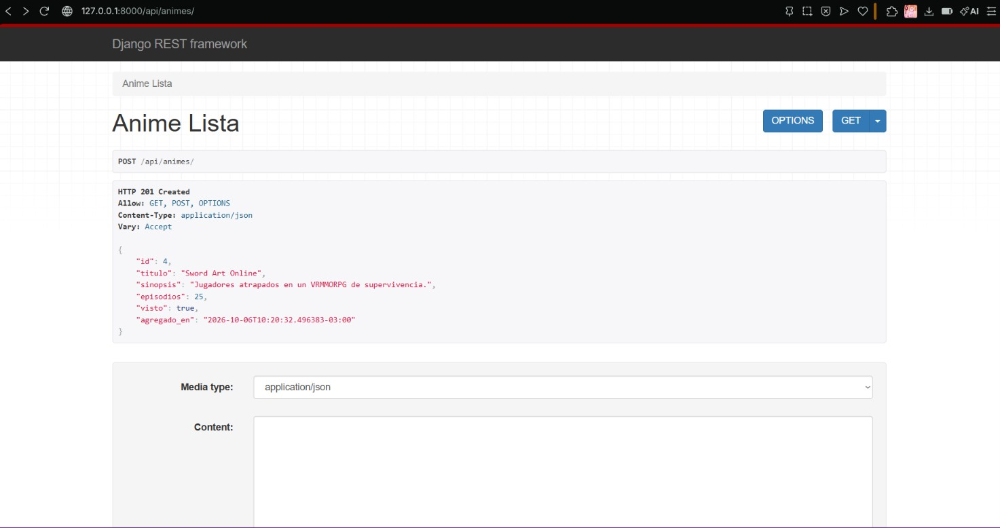

# Laboratorio 8: Django Rest Framework (DRF) - Serializers, Vistas y ORM

**Estudiante:** Juan Rafael Saravia Campos
**Fecha:** 06 de Octubre, 2026
**Proyecto:** Django AnimeList

## Preguntas de reflexión teórica

### 1. ¿Por qué se separan las responsabilidades del modelo, el serializer y la vista? ¿Qué ocurriría si la validación se realizara solo en el front-end?
- **Modelo (`models.py`):** Define la estructura de las tablas en la base de datos, relaciones y restricciones de persistencia.
- **Serializer (`serializers.py`):** Traduce entre tipos nativos de Python/JSON e instancias del modelo, validando que los datos de entrada cumplan las reglas del negocio antes de guardarse.
- **Vista (`views.py`):** Coordina el ciclo de vida de la petición HTTP, ejecuta consultas con el ORM y retorna la respuesta con el código de estado adecuado.
- **Riesgo:** Si la validación se dejara únicamente en el front-end, cualquier usuario podría eludirla con herramientas como Postman o cURL, permitiendo la inyección de datos corruptos o inconsistentes directamente en el backend.

### 2. ¿Qué ventajas y riesgos presenta usar `fields = '__all__'` en un ModelSerializer, en particular respecto de la exposición de datos?
- **Ventaja:** Acelera el desarrollo inicial al exponer automáticamente todas las columnas del modelo.
- **Riesgos:** Provoca sobreexposición de datos (*over-fetching* o fuga de información sensible agregada al modelo en el futuro) y vulnerabilidades de asignación masiva (*Mass Assignment*), permitiendo modificar campos que deberían ser de solo lectura.

### 3. ¿En qué situaciones preferiría APIView por sobre un ModelViewSet, pese a requerir más código?
Se prefiere APIView cuando el endpoint atiende lógica de negocio compleja fuera del estándar CRUD tradicional: flujos de autenticación personalizados, integración con pasarelas de pago, endpoints de analítica/reportes calculados, o cuando se requiere control granular sobre cada verbo HTTP (`GET`, `POST`, `PUT`).

### 4. ¿Cómo se manifestaría el problema N+1 en su API al crecer el volumen de datos y cómo lo detectaría?
Se manifiesta cuando el ORM realiza 1 consulta inicial para la lista principal y luego dispara N consultas adicionales por cada elemento para traer los datos de sus relaciones (como claves foráneas), degradando gravemente la latencia al escalar..

### 5. ¿Por qué importa que la API retorne el código HTTP correcto para que el front-end React gestione los errores?
Porque los códigos HTTP definen el contrato semántico de comunicación. Librerías como `fetch` o `axios` evalúan el estado de la respuesta: un `400 Bad Request` le indica al cliente que renderice los errores de validación en el formulario. 

## Capturas de evidencia del API

### 1. Listado general de animes (GET con @api_view - 200 OK)

### 2. Detalle de anime por ID (GET con APIView - 200 OK)

### 3. Creación exitosa de anime (POST deserializado y validado - 201 Created)
