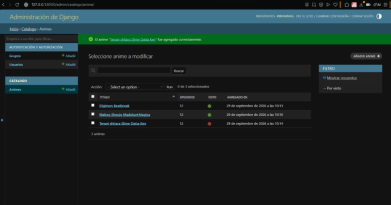
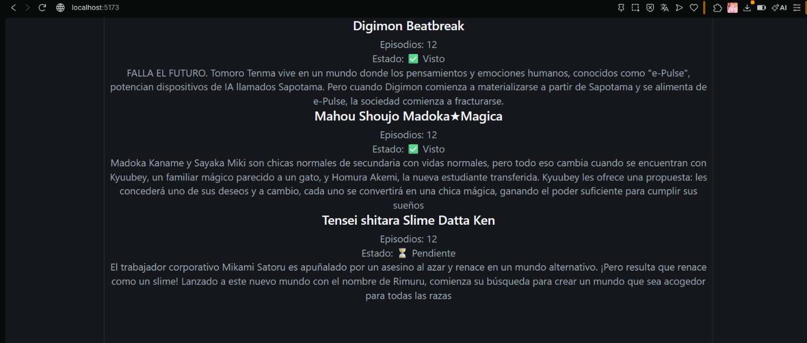
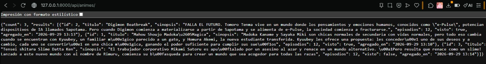

# Laboratorio 7: Integración Fullstack con Django, Django REST Framework y React

**Estudiante:** Juan Rafael Saravia Campos  
**Fecha:** 29 de Septiembre, 2026  
**Proyecto:** Django AnimeList

 # preguntas de reflexion teorica (respuesta)
 
 **pregunta 1** En entornos de desarrollo local, el uso de un proxy inverso configurado en vite.config.js evita tener que instalar y exponer configuraciones permisivas de CORS (django-cors-headers) en el backend.

**pregunta 2** ModelViewSet y los routers de DRF abstraen y unifican de forma estándar todas las operaciones CRUD (listar, crear, recuperar, actualizar y eliminar) en una única clase concisa. En lugar de declarar múltiples rutas y vistas individuales para cada método HTT.

**pregunta 3** Backend (Django / DRF): Se encarga de la capa de persistencia y datos, lógica de negocio, validación del modelo relacional en la base de datos (SQLite), autenticación/autorización y serialización de los registros en formato JSON a través de endpoints REST estructurados.
 **pregunta 3.1** Frontend (React / Vite): Es una aplicación cliente de una sola página (SPA) que se encarga del renderizado de la interfaz gráfica, experiencia de usuario, captura de eventos y gestión del estado local (useState, useEffect) para consumir asíncronamente los datos de la API y desplegarlos de manera reactiva

 # Captura de evidencia del api
 
 
 